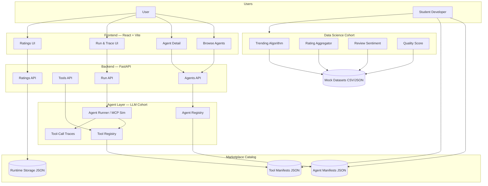
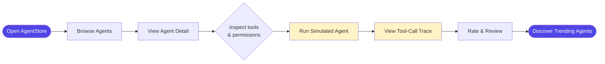
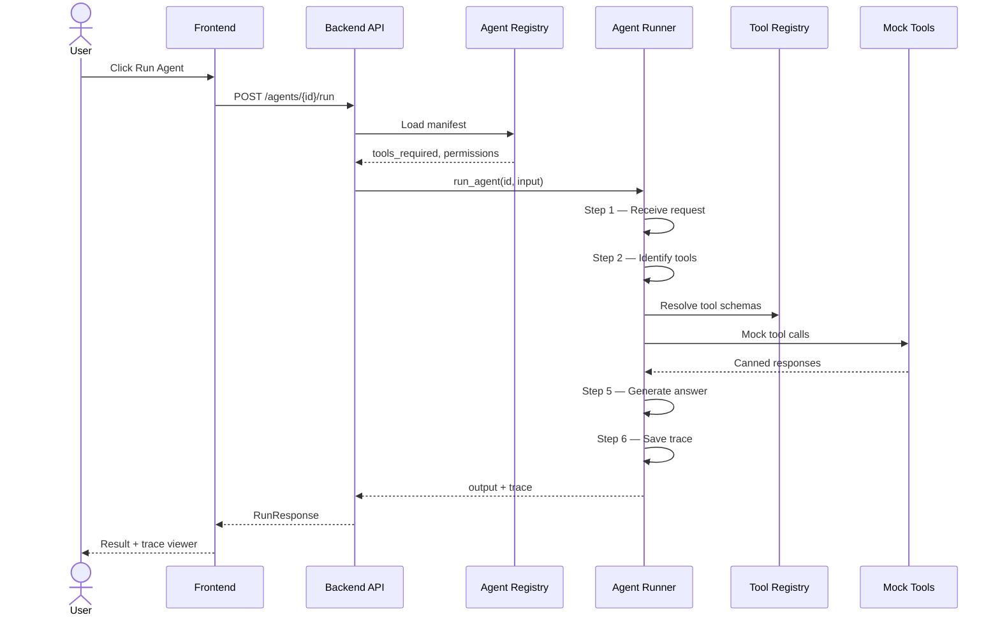
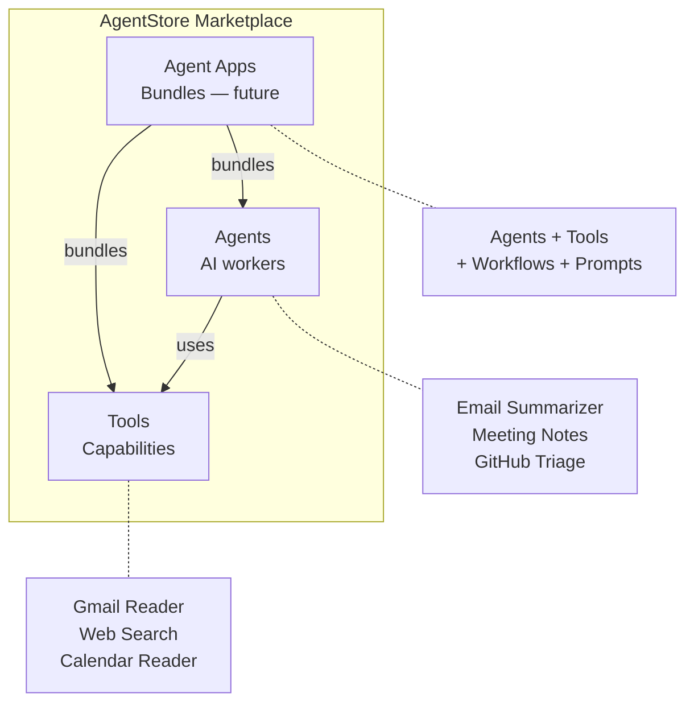
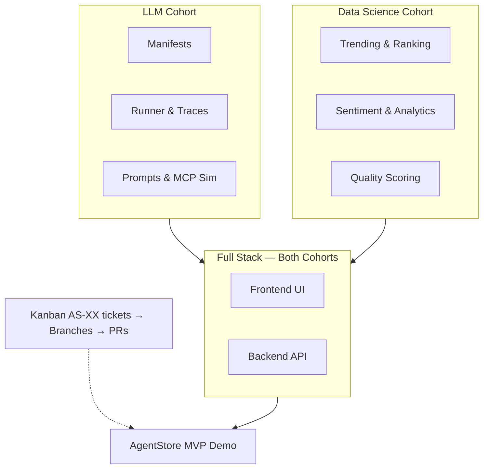

# AgentStore — Presentation Diagrams

Ready-to-use architecture and flow diagrams for TechX sessions.

## Quick Render Options

| Tool | How |
|------|-----|
| **PlantUML Online** | Paste `.puml` contents into [plantuml.com/plantuml](https://www.plantuml.com/plantuml/uml/) → export PNG/SVG |
| **VS Code / Cursor** | Install "PlantUML" extension → open `.puml` → `Alt+D` preview → export |
| **GitHub** | Mermaid blocks below render natively in this file |
| **Slides (Mermaid)** | Paste Mermaid into [mermaid.live](https://mermaid.live) → export PNG/SVG |
| **CLI** | `java -jar plantuml.jar presentations/diagrams/*.puml` |

---

## 1. System Architecture (Mermaid)

---

## 2. MVP User Journey (Mermaid)

---

## 3. Simulated Agent Run — Sequence (Mermaid)

---

## 4. Marketplace Entities (Mermaid)

---

## 5. Cohort Workstreams (Mermaid)

---

## PlantUML Source Files

| File | Use in session for |
|------|-------------------|
| [architecture.puml](./architecture.puml) | Overall system layers & cohort ownership |
| [user-journey-flow.puml](./user-journey-flow.puml) | End-to-end MVP demo walkthrough |
| [agent-run-flow.puml](./agent-run-flow.puml) | Deep dive on tool-call traces |
| [marketplace-concept.puml](./marketplace-concept.puml) | Product vision — Agents, Tools, Agent Apps |
| [cohort-workstreams.puml](./cohort-workstreams.puml) | How students split the work |

---

## Suggested Slide Order

1. **Marketplace concept** — what AgentStore is (Agents + Tools + Apps)
2. **Architecture** — layers and cohort responsibilities
3. **User journey** — live demo script flow
4. **Agent run sequence** — explain traces (agents are workflows, not magic)
5. **Cohort workstreams** — Kanban ticket model for students
